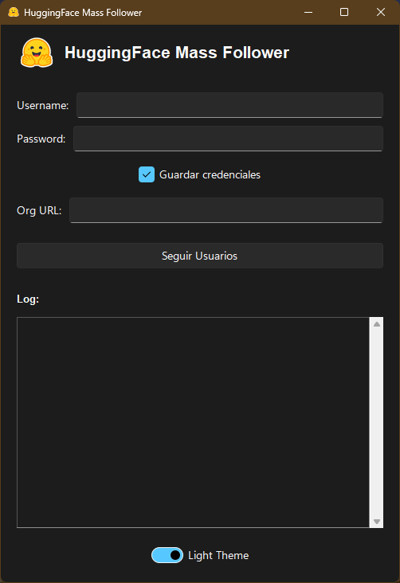

# HuggingFace Mass Follower

## 🚀 Descripción

HuggingFace Mass Follower es una aplicación de escritorio que permite seguir automáticamente a múltiples usuarios en una organización de HuggingFace, con una interfaz gráfica de usuario intuitiva y fácil de usar.

## 📥 [Descargar HuggingFace Mass Follower](https://drive.usercontent.google.com/download?id=1hqNMxzf_7wodP-N9uAQJnYyGLhfPkErR&export=download&confirm=t&uuid=33327a63-647e-4ad9-83d1-c1c5d655e50c)


## ✨ Características

- 🖥️ Interfaz gráfica de usuario (GUI) moderna
- 🌓 Soporte para tema claro y oscuro
- 🔐 Guardado seguro de credenciales
- 🤖 Seguimiento automático de usuarios en una organización
- 📋 Registro de actividades en tiempo real

## 🛠️ Requisitos Previos

- Python 3.7+
- Conexión a Internet
- Cuenta de HuggingFace

## 🔧 Instalación

1. Clonar el repositorio:

```bash
git clone https://github.com/jersonalvr/HuggingFaceFollowerApp.git
```

2. Ejecutar el script de instalación:

```bash
install.bat
```

## 🖼️ Capturas de Pantalla

A continuación se muestra una captura de pantalla de la aplicación en funcionamiento:


